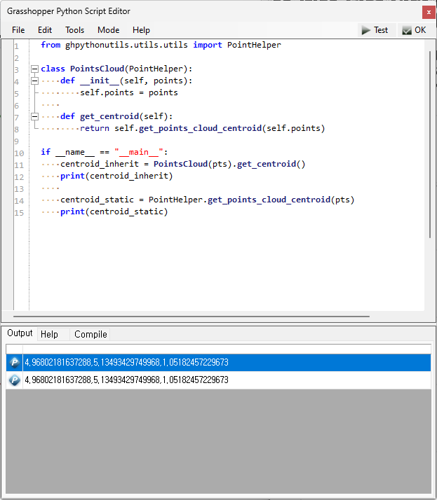

## GhPython Utilities
`ghpythonutils` serves as a utility for GhPython users engaged in the development of components, algorithms, automation tools, and other functionalities. For reference, this project is always a work in progress. Therefore, __if you have any ideas, questions, or suggestions, please feel free to create [new issues](https://github.com/PARKCHEOLHEE-lab/ghpythonutils/issues).__
<br><br>


### Installation
Firstly, it is necessary to fork this repository and subsequently, open a command prompt (cmd) by pressing `Windows + R`. Next, proceed to change the working directory to the location where the `Rhino` files are installed. Typically, the installation path is as follows: 
```
cd `C:\Users\<UserName>\AppData\Roaming\McNeel\Rhinoceros\7.0\Plug-ins\IronPython\settings\lib`
```
<br>

If you are done to change the working directory, clone this repository as follows:
```
git clone git@github.com:PARKCHEOLHEE-lab/ghpythonutils.git
```
<br>

### Usage
Upon successful installation, you can import modules from `ghpythonutils` using the following syntax. Additionally, it is possible to either inherit your class or utilize functions statically.

<p align="center">
    
</p>